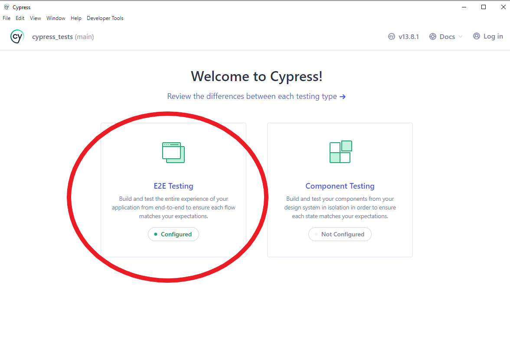
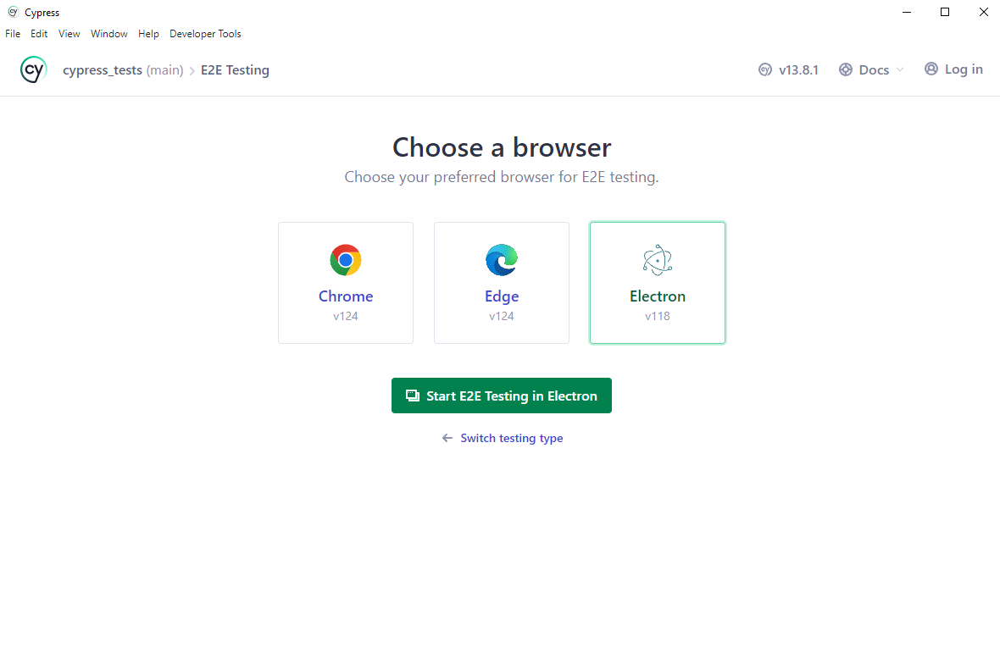
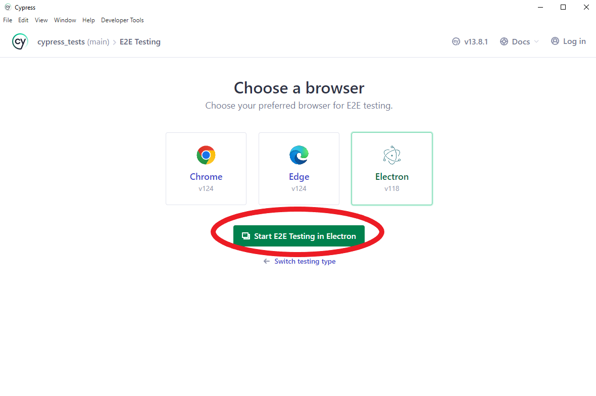

# Автотесты для ProfTeam - функционал роли "Студент"

Данный проект создан для автотестов на платформе ProfTeam с целью проверки функционала роли "Студент". Выполнено с использованием фреймворка Cypress.

# Процесс установки

1. Откройте любой редактор кода(например, WebStorm или Visual Studio Code)

2. Откройте терминал:

3. Клонируйте репозиторий в необходимую вам директорию:
   
```bash
   git clone https://github.com/aekkakti/cypress_tests
```

4. Перейдите в директорию проекта:

 ```bash
    cd cypress_tests
```

5. Установите зависимости:

 ```bash
    npm install
```

# Запуск автотестов

1. Запустите Cypress через терминал:
```bash
    npx cypress open
```

2. Перед вами откроется приветственное окно приложения Cypress, выберите E2E testing(см. ниже)



3. Затем выберите браузер, в котором хотите произвести автотесты(для стабильной работы рекомендуется выбирать Electron)



4. Нажмите кнопку "Start E2E testing in <<название выбранного браузера>>"



5. Перед вами откроется директория с автотестами, выберите любой для проверки отдельной функции студента

6. При нажатии на любой тест начнётся его выполнение, после завершения тестов будет предоставление отчёт о всех пройденных или проваленных тестах


# Какой функционал тестируется?

1. Авторизация студента
2. Изменение личных данных 
3. Регистрация в системе
4. Выбор роли студента
5. Привязка к образовательной организации

# P.S Обязательно к прочтению
Тесты в файлах registration.cy.js и change_info.cy.js могут выдавать провальные тесты(registration.cy.js по причине того, что данный пользователь имеется в системе, поэтому регистрация с теми же данными невозможна, 
а change_info.cy.js - в тесте, когда поле "О себе" принимает большое количество символов, сервер отдаёт 500 ошибку)

# Авторы

Выполнили:
  студенты 421 группы Иванов Гордей и Халиулина Лариса
  студент 412 группы Забелова Екатерина


